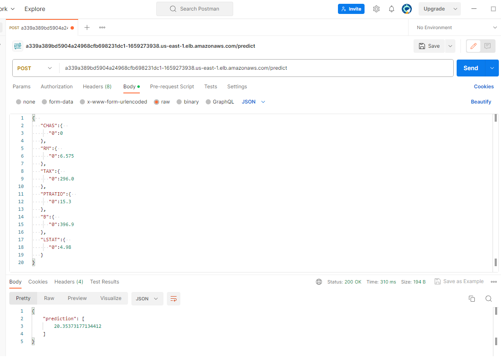

# Predicting Housing Prices in Boston Application
### Capstone Project - Udacity Cloud-Developer Nanodegree

## Project Overview

My final project for Udacity's Cloud Developer Nanodegree. The starter code of this project was provided by another Udacity Nanodegree program, specificly with Cloud DevOps Engineer Nanodegree program, on [the GitHub repo](https://github.com/udacity/DevOps_Microservices/tree/master/project-ml-microservice-kubernetes). The goal of that project is to operationalize a Machine Learning Microservice API using kubernetes locally (using minikube). I reused the starter code from that project and added the following features:
* The project has a public Docker image (in DockerHub)
* Use of a continuous integration (CI) tool (Travis) to build and push our application code as Docker images in DockerHub.
* The application runs on a Kubernetes cluster in the cloud.
* Use of a continuous deployments (CD) tool to deploy new version of the app automatically to production.
* The application is monitored by Amazon CloudWatch (add CloudWatch to EKS)

We are given a pre-trained, `sklearn` model that has been trained to predict housing prices in Boston according to several features, such as average rooms in a home and data about highway access, teacher-to-pupil ratios, and so on. You can read more about the data, which was initially taken from Kaggle, on [the data source site](https://www.kaggle.com/c/boston-housing). This project tests your ability to operationalize a Python flask app—in a provided file, `app.py`—that serves out predictions (inference) about housing prices through API calls. This project could be extended to any pre-trained machine learning model, such as those for image recognition and data labeling.

### Project Tasks

Our project goal is to operationalize this working, machine learning microservice using [kubernetes](https://kubernetes.io/) in the cloud, which is an open-source system for automating the management of containerized applications. In this project we will:
* Containerize this application (Complete a Dockerfile)
* Deploy the containerized application using Docker and make a prediction
* Set up Travis continuous integration pipeline to build and push our application code as Docker images in DockerHub
* Use of a continuous deployments (CD) tool to deploy new version of the app automatically to production.
* Configure Kubernetes and create a Kubernetes cluster in the cloud.
* Deploy the containerized application using Kubernetes in the cloud and make a prediction.
* Add Amazon CloudWatch to EKS, to monitor the application.

## Setup the Environment

* Create a virtualenv with Python 3.7 and activate it. Refer to this link for help on specifying the Python version in the virtualenv. 
```bash
python3 -m pip install --user virtualenv
# You should have Python 3.7 available in your host. 
# Check the Python path using `which python3`
# Use a command similar to this one:
python3 -m virtualenv --python=<path-to-Python3.7> .devops
source .devops/bin/activate
```
* Run `make install` to install the necessary dependencies

### Running `app.py`
1. Standalone:  `python app.py`
2. Run in Docker:  `./run_docker.sh`

### Using `app.py` 
Send POST request with a JSON body containes values of a variables (based on the dataframe described in data source) to the following endpoint:
`http://localhost:80/predict`

Or you can use the script `make_prediction.sh` to make a prediction. Where an example of a JSON body used with this script.

## Container Orchestration with Kubernetes
### Create an Amazon EKS Cluster and Node Group
1. Create the EKS Cluster
2. Create the EKS Node Groups
3. Connecting `kubectl` with EKS, you can use command like:
   
   `aws eks update-kubeconfig --region us-east-1 --name predicting-boston-housing-prices`

### Deployment
In this step, we deploy the Docker container for our application in its respective pods. For this step you need the deployment and service files in the directory `k8s-deployments`:
* The `api-predict-deployment.yaml` file is used to specify how our pods should be created.
* The `api-predict-service.yaml` file is used to specify how our pods are exposed.

Once, all deployment and service files are ready, you can use commands like:

`kubectl apply -f k8s-deployments/api-predict-deployment.yaml`

`kubectl apply -f k8s-services/api-predict-service.yaml`

### Connecting to the Kubernetes services to access the application
After the successful deployment, and services are created, you need to access the application. You can expose an external IP, using a Load Balancer's External IP. you can use command like:

`kubectl expose deployment api-predict --type=LoadBalancer --name=public-api`


### Useing the application after deploying to Kubernetes

Using the exposed external IP, send POST request to the API endpoint, link should look like:

[a339a389bd5904a24968cfb698231dc1-1659273938.us-east-1.elb.amazonaws.com/predict](a339a389bd5904a24968cfb698231dc1-1659273938.us-east-1.elb.amazonaws.com/predict)

You can use Postmann to send the HTTP request as follow:



## Explanation of the files in the repository

* `model_data/` Includes the pre-trained model and the dataset.
* `App.py` The source code of the Python flask app that serves out predictions (inference) about housing prices through API calls. 
* `Dockerfile` To containerize this application.
* `run_docker.sh` To run and build a docker image.
* `make_prediction.sh` To make a prediction (test the Python flask app)
* `upload_docker.sh` To upload an image to DockerHub.
* `deployment/update-kubeconfig.sh` To create or update a `kubeconfig` file for an Amazon EKS cluster.
* `deployment/deploy.sh` To deploy the application on the Kubernetes cluster in the cloud.
* `deployment/expose-external-ip.sh` To ceates an external load balancer and assigns a fixed external IP to the Service
* `deployment/autoscale.sh` To set horizontal scaling set against CPU usage.
* `deployment/install-metrics-server.sh` To install-metrics-server
